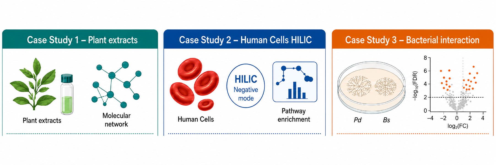

# Case Studies for [`MetaboCensoR`](https://github.com/plyush1993/MetaboCensoR)
### Description :bookmark_tabs:
This repository provides use cases and example workflows for [`MetaboCensoR`](https://github.com/plyush1993/MetaboCensoR), including all associated data files and code to reproduce computations & figures from the original [article](https://doi.org/10.64898/2026.07.02.735197).  

Three different datasets are provided:

- [**`orbi`**](https://github.com/plyush1993/MetaboCensoR_Examples/tree/main/orbi) - <ins>Case Study 1:</ins> Enhancing molecular networking in a plant LC-MS profiling dataset.
- [**`folate`**](https://github.com/plyush1993/MetaboCensoR_Examples/tree/main/folate) - <ins>Case Study 2:</ins> Enhancing functional analysis in a human cell lines LC-MS profiling dataset.
- [**`inter`**](https://github.com/plyush1993/MetaboCensoR_Examples/tree/main/inter) - <ins>Case Study 3:</ins> Enhancing statistical analysis in a bacterial interaction LC-MS profiling dataset.

R script and data to reproduce additional figures: [`for figures.R`](https://github.com/plyush1993/MetaboCensoR_Examples/blob/main/for%20figures.R).  
R script and data to reproduce annotation comparison table: [`table_annotation`](https://github.com/plyush1993/MetaboCensoR_Examples/tree/main/table_annotation).
R script and data to reproduce benchmarking table: [`tool_benchmarking`](https://github.com/plyush1993/MetaboCensoR_Examples/tree/main/tool_benchmarking).

> [!IMPORTANT]
> Scripts were compiled using [R version 4.1.2](https://cran.r-project.org/bin/windows/base/old/4.1.2/) 
> [`Full Session Info`](https://github.com/plyush1993/MetaboCensoR_Examples/blob/main/session_info.txt)
 

### Citation :link:
If you use **`MetaboCensoR`** in your study, please cite this paper:

> [Plyushchenko I.V. & Luzzatto-Knaan T. "*MetaboCensoR*: A Shiny Application for Data Filtering in Untargeted LC-MS Metabolomics to Enhance Interpretability" *bioRxiv* 2026.07.02.735197](https://doi.org/10.64898/2026.07.02.735197)
 

### Contact :mailbox_with_mail:

  
  
  
  

